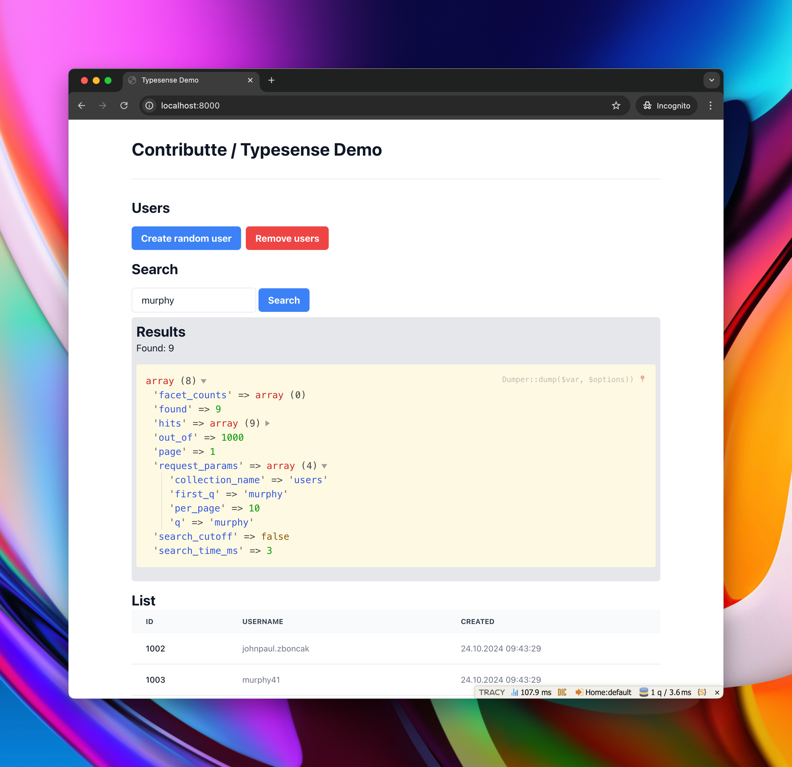

<p align=center>
  <a href="https://github.com/contributte/demo-typesense/actions"></a>
  <a href="https://packagist.org/packages/contributte/demo-typesense"></a>
  <a href="https://packagist.org/packages/contributte/demo-typesense"></a>
</p>
<p align=center>
  <a href="https://packagist.org/packages/contributte/demo-typesense"></a>
  <a href="https://github.com/contributte/demo-typesense"></a>
  <a href="https://bit.ly/ctteg"></a>
  <a href="https://bit.ly/cttfo"></a>
  <a href="https://contributte.org/partners.html"></a>
</p>

<p align=center>
Website 🚀 <a href="https://contributte.org">contributte.org</a> | Contact 👨🏻‍💻 <a href="https://f3l1x.io">f3l1x.io</a> | Twitter 🐦 <a href="https://twitter.com/contributte">@contributte</a>
</p>

----



-----

## Goal

Demo of [Typesense](https://typesense.org/) Search Engine to Nette ([@nette](https://github.com/nette)) by [@f3l1x](https://github.com/f3l1x).

## Installation

You will need `PHP 8.2+` and [Composer](https://getcomposer.org/).

Create project using composer.

```bash
composer create-project -s dev contributte/demo-typesense acme
```

Now you have application installed. It's time to run it.

## Startup

1. Spin up PostgreSQL database. It will load `init.sql` file, thus you don't have to create schema manually.

```bash
docker compose up
```

2. Prepare search engine structure in Typesense.

```bash
bin/setup
```

3. Prepare fake data in PostgreSQL (optional).

```bash
bin/fake
```

4. Start PHP built-in web server.

```bash
bin/dev
# or
php -S 0.0.0.0:8000 -t www
```

Then visit [http://localhost:8000](http://localhost:8000) in your browser.

## Development

See [how to contribute](https://contributte.org/contributing.html) to this package.

This package is currently maintaining by these authors.

<a href="https://github.com/f3l1x">
    
</a>

-----

Consider to [support](https://contributte.org/partners.html) **contributte** development team.
Also thank you for using this project.
